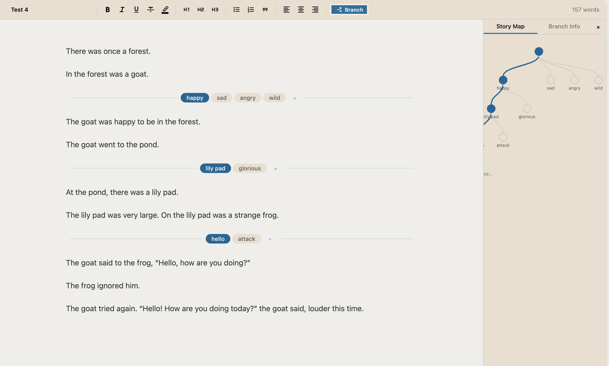
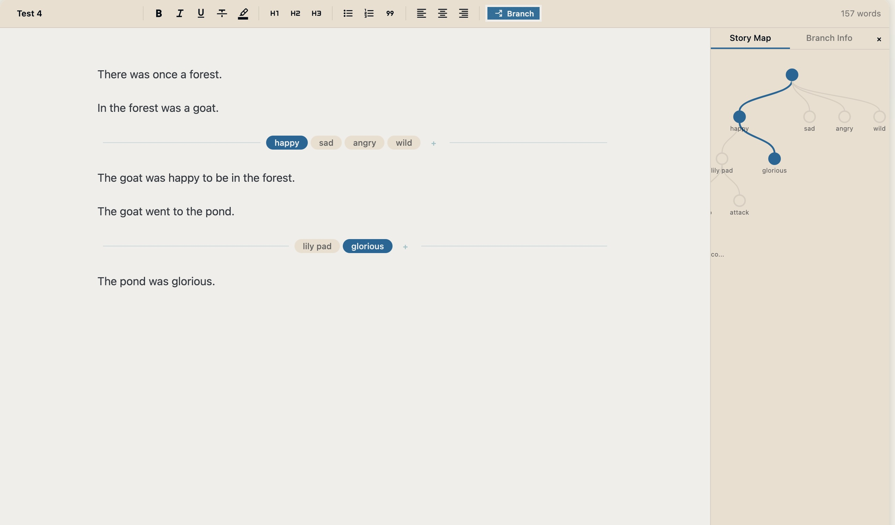
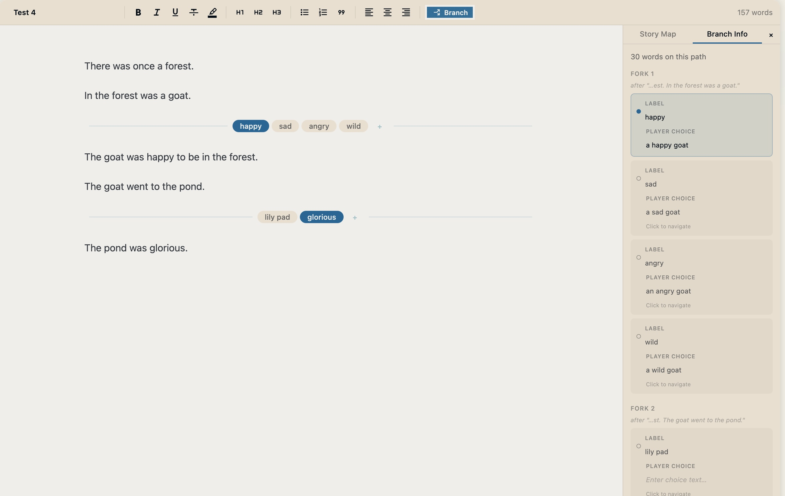

# typewriter

An editor for creating branching narrative games. Try it out at typewriter.akorl.xyz

Typewriter lets you write interactive fiction one full branch at a time. Write the entire story end to end, and then go back and add additional branches. Or build out branches as you go. 

This is not a tool to build and deploy interactive fiction games. It is a tool for writers and game developers to have a nice clean place to write their story, which they can then export into the game engine of their choice. 

## Roadmap

Planned features:
- [x] Export to Twine for build and deployment
- [ ] Potentially: export to renpy as well, although renpy has a different interactive fiction ethos. 
- [ ] Export to standard markdown, text files, and json. Planned exports will also include a way to just export a complete single path as a markdown file, as well as other paths. Potentially also find a way to export into a format that you could turn into a print document nicely. 
- [ ] Additional UI improvements
- [ ] Adding help hints, a tutorial, other onboarding
- [ ] Let branches recombine
    - [x] Almost done, but currently there's a bug where you can't switch branches nicely between a merged branch and a regular branch in the editor (but you can in the minimap).
    - [x] Also need to add in the functionality to switch to a branch path by clicking the pathway, i.e. so that you can open up the merged path 
    - [ ] Update how the player choice option works so that different nodes that lead to the same branch can have different player choices. 
- [ ] Add something to track and set variables, ability to reference variables in the narrative without breaking the writing flow
- [ ] Templates/reusable blocks
- [ ] Table of contents
- [ ] Dark mode, other themes
- [ ] Automatic exports (for backup purposes)
- [x] Open up minimap into a bigger view

## FAQ

### Who is this for?

This is for writers and game developers who want a place where they can write their story in a more narrative way, while still allow you to put in branching. This is meant to be a tool used in conjunction with other game engines like renpy or Twine, not a replacement for those. 

### Where is my data stored?

Your data is stored in your own browser local storage. There is no cloud storage, no external database, no cookies. Your data fully belongs to you for better or worse. Make sure to backup your story frequently!

More specifically, the app uses IndexedDB. Read more about it here: https://developer.mozilla.org/en-US/docs/Web/API/IndexedDB_API

### Is there any AI in this?

I used Claude Code to write the app, but the app itself does not use AI or have any AI features. The example story in the screenshots above does not include any generative AI (as you can probably tell...).

### Why would I use this over \<insert tool here\>?

You don't have to! This is a small hobby project and it's expected that there will be bugs and strange behavior. Please backup your work regularly.

But this tool is free, open source, has no ads, and your data never leaves your device. 

### How do I report a bug?

Go ahead and open an issue in this github project. I'll take a look as soon as I can!